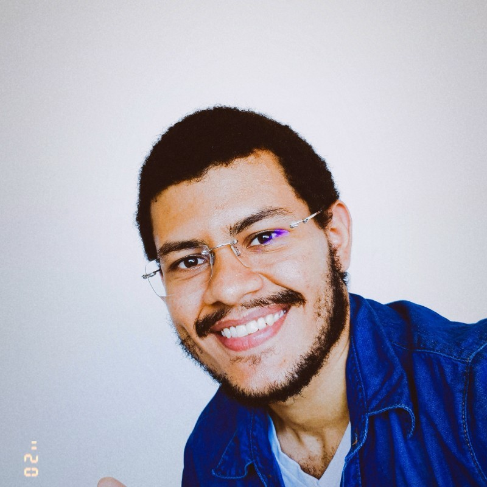
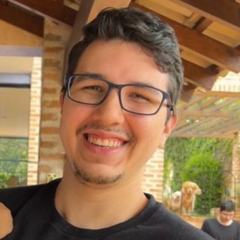
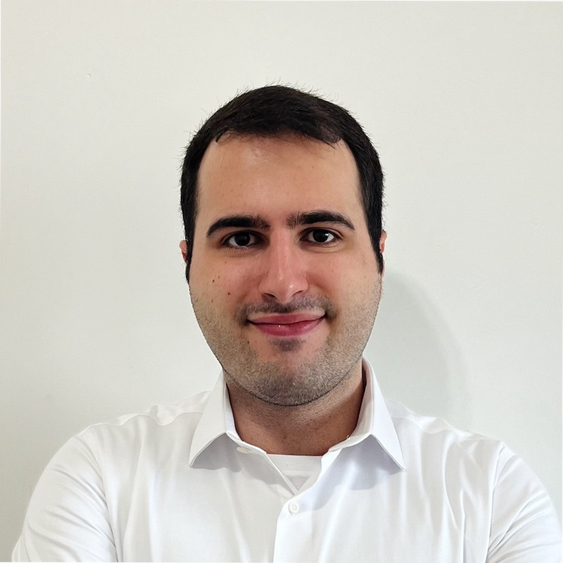
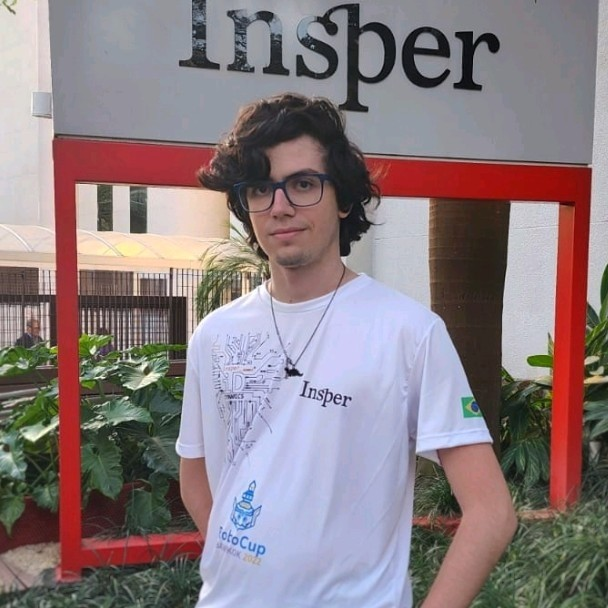
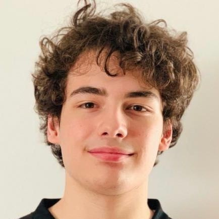
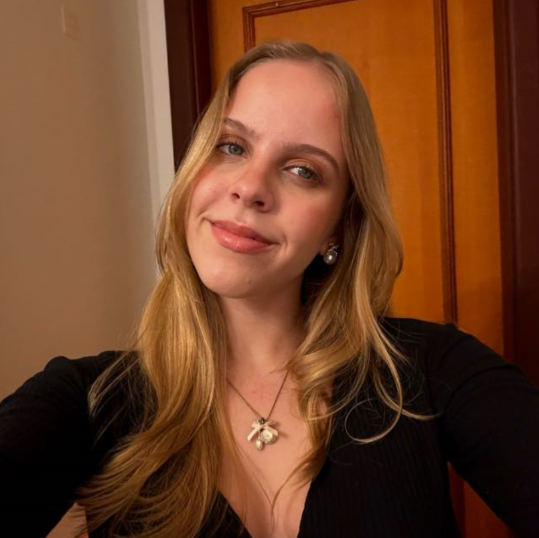
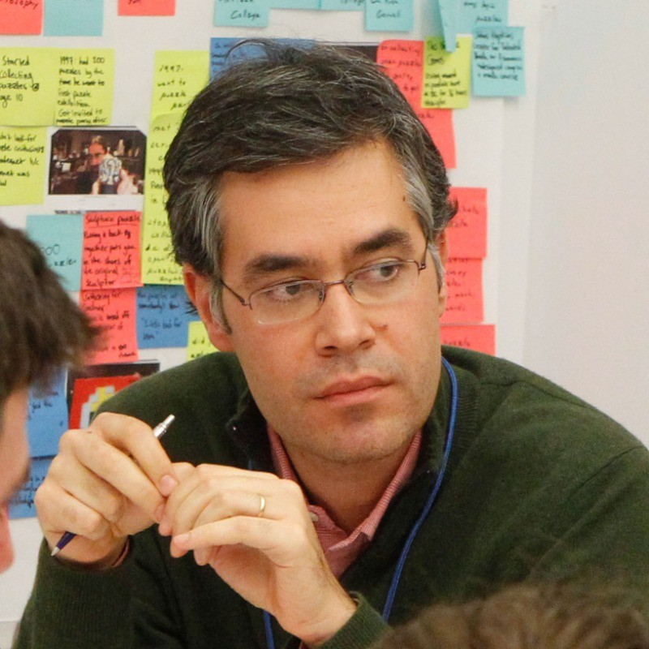

Contributors
============

This project was developed by a team of 8 members, under the guidance of an advisor and a mentor. Below are the details of each contributor.

Team Members - V1
------------------

Breno Alencar Araújo
^^^^^^^^^^^^^^^^^^^^

.. raw:: html

   

   LinkedIn: <a href="https://www.linkedin.com/in/brenoaalencar/">Breno Alencar Araújo</a> 
   GitHub: <a href="https://github.com/Brenoaalencar">github.com/Brenoaalencar</a>
   

Bruno Morales Balkins
^^^^^^^^^^^^^^^^^^^^^

.. raw:: html

   

   LinkedIn: <a href="https://www.linkedin.com/in/bruno-balkins-777141189/">Bruno Balkins</a>
   

Fernando Bichuette Assumpção
^^^^^^^^^^^^^^^^^^^^^^^^^^^^

.. raw:: html

   

   LinkedIn: <a href="https://www.linkedin.com/in/fernando-bichuette-assumpcao/">Fernando Bichuette Assumpção</a> 
   GitHub: <a href="https://github.com/FernandoBichuette">github.com/FernandoBichuette</a>
   

Giulia Carolina Martins de Sampaio
^^^^^^^^^^^^^^^^^^^^^^^^^^^^^^^^^^
.. image:: _static/giulia.png
   :width: 200px
   :align: center

Team Members - V2
------------------

Felipe Catapano Emrich Melo
^^^^^^^^^^^^^^^^^^^^^^^^^^^

.. raw:: html

   

   LinkedIn: <a href="https://www.linkedin.com/in/felipe-catapano/">Felipe Catapano Emrich Melo</a> 
   GitHub: <a href="https://github.com/MekhyW">github.com/MekhyW</a>
   

Rafael Eli Katri
^^^^^^^^^^^^^^^^

.. raw:: html

   

   GitHub: <a href="https://github.com/rafakatri">github.com/rafakatri</a>
   

Gabriel Brunoro Motta Tumang
^^^^^^^^^^^^^^^^^^^^^^^^^^^^

.. raw:: html

   

   LinkedIn: <a href="https://www.linkedin.com/in/gabriel-tumang/">Gabriel Tumang</a> 
   Email: <a href="mailto:gabrieltumang10@gmail.com">gabrieltumang10@gmail.com</a>
   

Luana de Matos Sorpreso
^^^^^^^^^^^^^^^^^^^^^^^

Advisor
-------

Prof. Dr. Vinícius Licks
^^^^^^^^^^^^^^^^^^^^^^^^

.. raw:: html

   

   LinkedIn: <a href="https://www.linkedin.com/in/viniciuslicks/">Vinícius Licks</a> 
   Email: <a href="mailto:licks.vinicius@gmail.com">licks.vinicius@gmail.com</a>
   

Mentor
------

Thiago Teixeira Santos
^^^^^^^^^^^^^^^^^^^^^^

.. raw:: html

   

   Email: <a href="mailto:thiago.santos@embrapa.br">thiago.santos@embrapa.br</a>
   

Documentation
----------------------------------------

The documentation and repository maintenance for this project was handled by Felipe Catapano Emrich Melo.

We would like to express our gratitude to all contributors for their hard work and dedication to this project.

