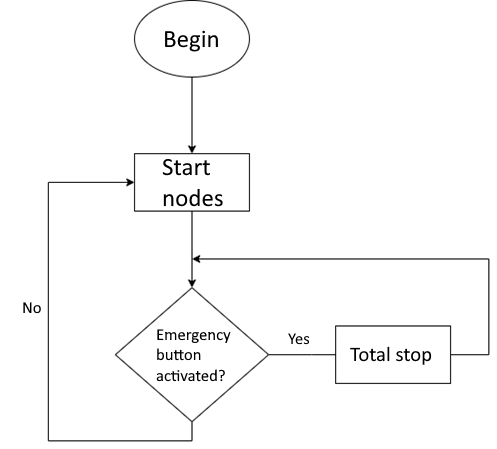

Remote Control Operation
========================

The UGV (Unmanned Ground Vehicle) can be operated manually using a Spektrum DXS radio control transmitter, which communicates with a receiver installed in the UGV. This section describes how to use the remote control for manual operation of the robot.

Controller Setup
----------------

The mapping of control buttons and levers has been configured to facilitate the operation of the UGV. The following parameters have been set for the controller:

- **scale_linear.x**: 0.12
- **axis_linear.x**: 1
- **axis_angular.yaw**: 2
- **axis_angular.pitch**: 4
- **scale_angular.yaw**: 1.25
- **scale_angular.pitch**: 0.25
- **scale_angular_turbo.yaw**: 0.0
- **scale_linear_turbo.x**: 0.0
- **enable_button**: 0
- **enable_turbo_button**: 1

These parameters are used by the ROS 2 `joy` node to interpret the controller inputs.

Control Mapping
---------------

1. **Speed Control**:
   The left lever controls the speed of the UGV. Push forward to move the UGV forward, and pull back to reverse.

2. **Direction Control**:
   The right lever is responsible for steering the UGV. Move the lever left or right to rotate the UGV in the respective direction.

3. **On/Off Switch**:
   The lower central button turns the UGV on or off.

4. **Emergency Stop**:
   The emergency button is located at the top left of the controller. When pressed, it immediately stops the UGV by setting `scale_linear_turbo` to 0.0.

5. **Fine Rotation**:
   A switch at the top right of the controller allows for fine adjustment of rotation.

6. **Deadman Switch**:
   Located on the back of the controller, this button must be continuously pressed to keep the UGV operational. Releasing it will immediately stop the UGV as a safety measure.

Emergency Routine
-----------------

An emergency routine has been implemented to ensure the operational safety of the rover:

1. When the emergency button is pressed, `scale_linear_turbo` is set to 0.0.
2. This results in the rover coming to a complete and immediate stop.

Operating the UGV
-----------------

1. Ensure the receiver dongle is properly connected to the UGV.
2. Turn on the Spektrum DXS radio control transmitter.
3. Use the On/Off switch to power up the UGV.
4. Press and hold the Deadman switch on the back of the controller.
5. Use the left lever to control speed and the right lever to steer.
6. For fine rotations, use the rotation switch at the top right.
7. In case of emergency, press the emergency stop button to immediately halt the UGV.
8. When finished, use the On/Off switch to power down the UGV.

Remember to always operate the UGV in a safe environment and follow all safety protocols.

