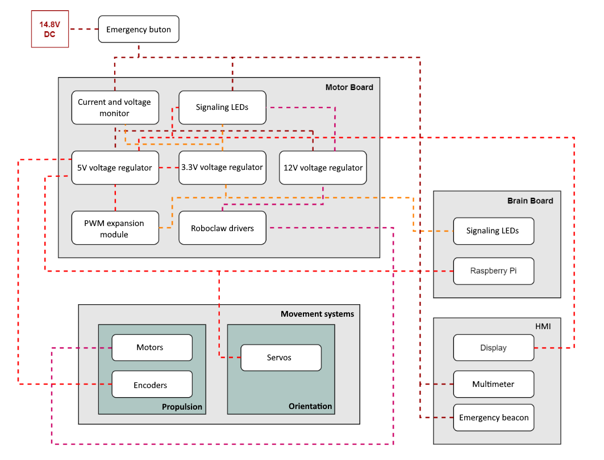
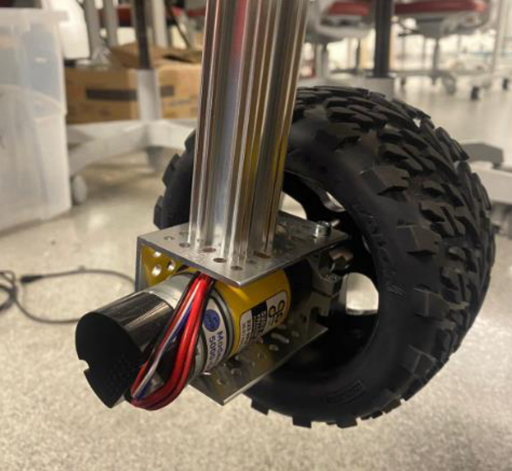

Schematics and Wiring
=====================

Prerequisites
--------------
The prototype's electronics are made up of two boards: the motor drive board (Motor Board), where the power circuits are located, and the board responsible for controlling the entire system's operation (Brain Board), where the control circuits are located and a Raspberry Pi 4, model B, 8 GB, with a 64-bit quad-core ARM-Cortex A72 microprocessor, running at 1.5 GHz, is located.

The main electronics are based on the original platform schematics found at https://github.com/nasa-jpl/open-source-rover/blob/master/electrical/pcb/control_board/documentation/v2.0.1/schematics.pdf, and the following diagrams:

   Electronic boards.

   Electrical diagram.

.. figure:: _static/signal_diagram.png
   :alt: Signal diagram
   :width: 80%
   :align: center

   Signal diagram.

Power Supply Setup
----------------------
a) Battery Configuration
   
   - Use a 14.8V DC battery
   
   - Connect through protection circuit containing:
        
        * Fuse
        * 1 kΩ resistor
        * Protection diode

b) Voltage Regulation System
   
   - Install voltage regulators:
    
        * 14.8V → 12V (D24V22Fx) for Roboclaw drivers
        * 14.8V → 5V (D24V150Fx) for main systems
        * 5V → 3.3V (MIC2937A-3.3WT) for low-power components

c) Power Distribution

   12V powers:

   - Roboclaw motor drivers

   5V powers:
   
   - Raspberry Pi
   
   - PWM expansion module
   
   - Servo motors
   
   - HMI display
   
   - Motor encoders

   3.3V powers:
   
   - PWM expansion (PCA9685)
   
   - INA260 monitor
   
   - Status LEDs

Motor System Installation
----------------------------

There are two different types of motors being used: brushed DC motors, used to propel the system, and servos, used to change the robot's orientation.

The DC motors are the “5203 Series Yellow Jacket Planetary Gear Motor” model, manufactured by GoBilda, and have a maximum torque of 38 kg.cm. A total of 6 motors are used to move the robot, each equipped with a magnetic encoder, which performs the reading through a hall effect sensor. These readings can be monitored in a specific node, ‘roboclaw_movemotor.py’, contained in: osr-rover-code/scripts/ in the repository of only the robot codes.

The servo motors used are the “Dsservo DS3225” model and have a maximum torque of 21 kg.cm with the 5 V supplied by the drive board. In total, 4 actuators of this type are required to control the robot's orientation, enabling lateral dynamics.

.. warning::
   The servo motors used do not have the same range of rotation as the ones from the original NASA design (180 instead of the original 300 degrees). This required changes to the control system to adapt to the new range.

a) DC Motors
   
   - Install 6x GoBilda 5203 Series Yellow Jacket Planetary Gear Motors
   
   - Specifications: 38 kg.cm maximum torque
   
   - Connect magnetic encoders to each motor
   
   - Wire to Roboclaw drivers

   DC motor.

b) Servo Motors
   
   - Install 4x Dsservo DS3225
   
   - Specifications: 21 kg.cm at 5V
   
   - Connect to PCA9685 PWM expansion module

   Servo motor.

Control Systems Setup
----------------------
Considering the communication between the microcomputer and the voltage and current monitoring module (INA260), it is noted that data is also sent via an I2C communication protocol. The module also communicates with the signaling LEDs to alert the user if its internal shunt resistor detects any change in the power supply system.

a) PWM Control
   
   - Install PCA9685 module
   
   - Connect to Raspberry Pi via I2C
   
   - Wire 16 PWM channels as needed

In addition to the expansion module and the monitor, communication with the HMI display, which will be implemented in the future, will also take place using the I2C protocol. The reason for this choice is that the control board has an available I2C bus, which could be adapted for connecting the display with a low number of adaptations required.

Another important observation regarding the diagram is that the Raspberry Pi is also responsible for controlling the 12V voltage regulator through an enable signal, turning the 12V output on or off.

Analyzing the control board a little more, we can see the presence of some signaling LEDs. These components are intended to communicate with the user, signaling, for example, when data is being transferred via the serial port, lighting up when the bits are transferred.

b) Monitoring System
   
   - Install INA260 module
   
   - Connect via I2C to Raspberry Pi
   
   - Wire status LEDs for power monitoring

Safety Systems
---------------
To ensure the prototype's compliance with the occupational safety standard for machines and equipment (NR-12), it was necessary to include an emergency circuit, containing a physical emergency button and ensuring the robot's complete stop, in addition to de-energizing the control and power boards, through a normally closed switch, responsible for cutting off the power supplied to both boards.

a) Emergency Circuit
   
   - Install physical emergency button (NC switch)
   
   - Wire to power cutoff system for both boards
   
   - Configure remote emergency via radio control

.. figure:: _static/emergency_circuit.png
   :alt: Emergency circuit
   :width: 80%
   :align: center

   Emergency circuit.

b) Status Indicators
   - Install status LEDs for:
        
        * Serial communication
        
        * Power status
        
        * Emergency status

Display Installation
---------------------
To display relevant information about the robot's status, such as connectivity, battery percentage, etc., a 16x02 LCD display with an I²C conversion module was installed, as provided in the project's solution matrix. It was necessary to supply it with 5V on one of the available power pins indicated by the brain board's silkscreen, as well as connect the SDA and SCL pins.

- Install 16x02 LCD display with I²C module

- Connect to 5V power

- Wire SDA and SCL pins to Raspberry Pi

.. figure:: _static/display_wiring.png
   :alt: Display wiring
   :width: 80%
   :align: center

   Display wiring.

Wiring Guidelines
------------------
The wiring required for power supply, encoder reading and signal transmission to the actuators followed the instructions in the GitHub repository at: https://github.com/nasa-jpl/open-source-rover/tree/master/electrical/wiring. The suggested dimensions, however, were reduced, so an excess of at least 10 cm was added to each wire. The color code was respected as well as the gauge of the motor power wires. Wires for control signals were replaced with smaller AWG gauge two-piece.

- Add 10cm extra length to all specified wire lengths

- Follow color coding scheme

- Use specified AWG for motor power

- Use smaller AWG for control signals

Dell Optiplex Power Supply
--------------------------

In order to use the Optiplex 7000MFF, a power supply circuit responsible for adjusting the battery voltage from 14.8V to the computer's input voltage of 19.5V is necessary. 

This is accomplished using a step-up voltage regulator, which takes advantage of the available components on the motherboard and the power supply circuit, and is installed after the fuse and multimeter.

   Diagram of the step-up voltage regulator.

The regulator module can potentially reach dangerous temperatures if not properly isolated from the surrounding components and cooled. In order to test the power regulator for efficiency and thermal performance, the following test circuit can be used:

   Test circuit for the power regulator.

GPS Module Board
------------------

The GPS module board integrates a NEO-6M GPS module with a TTL to USB converter. The board can be manufactured using the provided KiCad design files located in the Electronics/GPS directory.

a) Manufacturing Files
  
  The following files are required for PCB fabrication:
  
  - Circuit design: GPS.kicad_sch
  - PCB layout: GPS.kicad_pcb
  - Drill files:
       * FabOutput/Gerber/GPS-NPTH.drl (Non-plated holes)
       * FabOutput/Gerber/GPS-PTH.drl (Plated holes)
       * FabOutput/Drill/GPS-NPTH.drl (Non-plated holes backup)
       * FabOutput/Drill/GPS-PTH.drl (Plated holes backup)

b) Manufacturing Specifications
  
  - Board material: FR4
  - Layers: 2
  - Thickness: 1.6mm
  - Copper weight: 1oz
  - Surface finish: HASL (lead-free)
  - Solder mask: Green
  - Silkscreen: White

c) Assembly Instructions
  
  1. Order PCB fabrication using provided Gerber and drill files
  2. Solder components in the following order:
       * TTL to USB converter
       * Power regulation components
       * GPS module socket
       * Pin headers
  3. Install GPS module into socket
  4. Verify all connections with multimeter before powering

d) Testing
  
  - Check voltage levels at power test points
  - Verify USB enumeration when connected
  - Test GPS signal acquisition in open area
  - Confirm serial communication at 9600 baud

.. note::
  The board design includes protection circuitry and proper power regulation for reliable operation.

Testing and Verification
------------------------
- Test voltage levels at all regulation points

- Verify emergency shutdown functionality

- Test motor control systems

- Confirm encoder readings using roboclaw_movemotor.py

- Verify I2C communication with all peripherals

.. note::
   Always refer to the original schematics for detailed connection diagrams and component specifications.