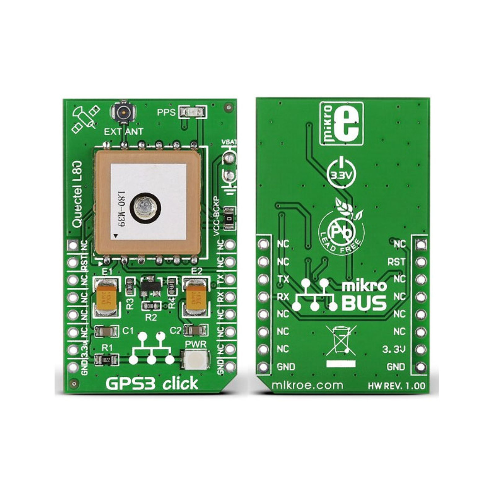

Waypoint Navigation
===================

The UGV uses Nav2 for autonomous navigation with GPS waypoints. The navigation stack is configured through several parameter files that control different aspects of the navigation system.

To learn more about Nav2, refer to the `official documentation <https://docs.nav2.org/>`_.

Global Route Planning
---------------------

The global planner generates an optimal path from the robot's current position to the goal. We use the SMAC Hybrid-A* planner with the following key parameters:

.. code-block:: yaml

    planner_server:
      ros__parameters:
        planner_plugins: ["GridBased"]
        GridBased:
          plugin: "nav2_smac_planner/SmacPlannerHybrid"
          tolerance: 0.25                     # Goal tolerance in meters
          allow_unknown: true                 # Allow planning through unknown space
          max_planning_time: 5.0              # Maximum time allowed for planning
          motion_model_for_search: "DUBIN"    # Use Dubins car motion model
          minimum_turning_radius: 0.40        # Minimum turning radius in meters

Local Trajectory Control
------------------------

For local trajectory control, multiple controller options are available:

Regulated Pure Pursuit (RPP)
^^^^^^^^^^^^^^^^^^^^^^^^^^^^^

The RPP controller provides smooth path following with obstacle avoidance:

.. code-block:: yaml

    controller_server:
      ros__parameters:
        controller_plugins: ["FollowPath"]
        FollowPath:
          plugin: "nav2_regulated_pure_pursuit_controller::RegulatedPurePursuitController"
          desired_linear_vel: 0.5             # Maximum forward velocity
          lookahead_dist: 0.6                 # Base lookahead distance
          min_lookahead_dist: 0.3             # Minimum lookahead distance
          max_lookahead_dist: 0.9             # Maximum lookahead distance
          use_velocity_scaled_lookahead_dist: false
          use_collision_detection: true        # Enable collision checking

Vector Pursuit
^^^^^^^^^^^^^^^

The Vector Pursuit controller offers an alternative approach:

.. code-block:: yaml

    controller_server:
      ros__parameters:
        controller_plugins: ["FollowPath"]
        FollowPath:
          plugin: "vector_pursuit_controller::VectorPursuitController"
          desired_linear_vel: 0.5             # Maximum forward velocity
          min_turning_radius: 0.25            # Minimum turning radius
          lookahead_dist: 1.0                 # Base lookahead distance
          use_collision_detection: true        # Enable collision checking

Behavior Server
---------------

The behavior server manages recovery behaviors when the robot encounters difficulties:

.. code-block:: yaml

    behavior_server:
      ros__parameters:
        behavior_plugins: ["spin", "backup", "drive_on_heading", "wait"]
        spin:
          plugin: "nav2_behaviors/Spin"       # Rotate in place
        backup:
          plugin: "nav2_behaviors/BackUp"     # Move backwards
        drive_on_heading:
          plugin: "nav2_behaviors/DriveOnHeading"  # Drive straight
        wait:
          plugin: "nav2_behaviors/Wait"       # Wait in place

Costmap Configuration
---------------------

Both global and local costmaps are configured to handle obstacles:

.. code-block:: yaml

    local_costmap:
      local_costmap:
        ros__parameters:
          update_frequency: 5.0
          publish_frequency: 2.0
          width: 3                            # Local costmap width in meters
          height: 3                           # Local costmap height in meters
          resolution: 0.05                    # Resolution in meters/cell
          robot_radius: 0.18                  # Robot radius for collision checking

    global_costmap:
      global_costmap:
        ros__parameters:
          update_frequency: 1.0
          publish_frequency: 1.0
          resolution: 0.05                    # Resolution in meters/cell
          track_unknown_space: true           # Track unknown areas

GPS Integration
----------------

To allow the robot to navigate through coordinates in the WGS84 reference frame, a Quectel L-80 M39 GPS (GPS3 Click module) with a TTL-USB adapter is used.

The GPS waypoints are processed through a dedicated node (``osr_autonomous/gps_follower.py``) that converts GPS coordinates to map coordinates (using UTM projection) and sends them to Nav2's waypoint follower:

   GPS module.

.. code-block:: yaml

    waypoint_follower:
      ros__parameters:
        loop_rate: 20
        stop_on_failure: false
        waypoint_task_executor_plugin: "wait_at_waypoint"
        wait_at_waypoint:
          plugin: "nav2_waypoint_follower::WaitAtWaypoint"
          enabled: True
          waypoint_pause_duration: 200        # Time to wait at each waypoint (ms)

The GPS interface node subscribes to waypoints published in GPS coordinates and transforms them to the map frame before sending them to Nav2 for execution.

